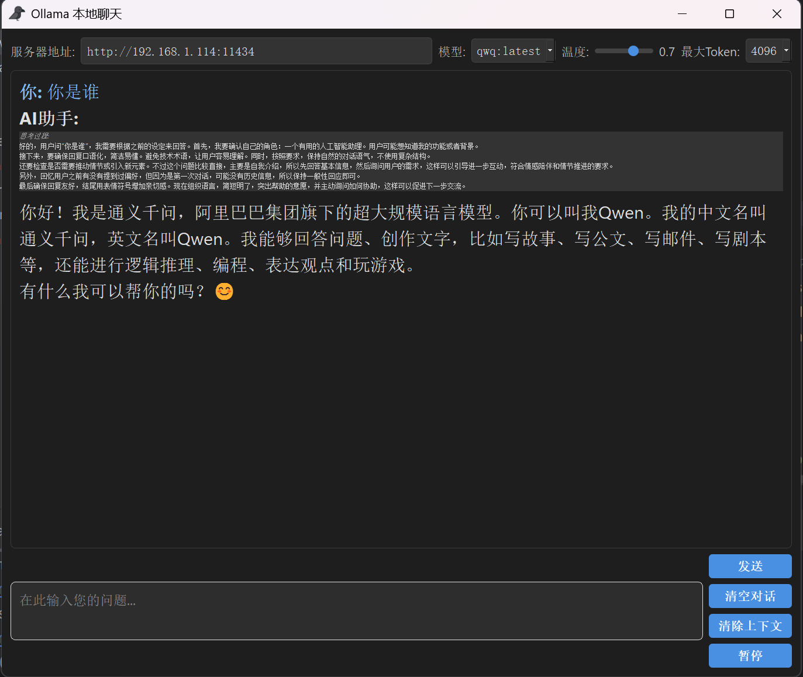

# Ollama Local Chat Client

This desktop application allows you to interact with Ollama models running on your local network. It provides a clean, user-friendly interface for chatting with various AI models through the Ollama API.



## Features

- Connect to any Ollama server by specifying the URL
- Support for multiple AI models (qwq, llama3, mixtral, phi3)
- Adjustable temperature setting for response randomness (0.0-1.0)
- Configurable maximum token length (1024-8192)
- Real-time streaming responses
- Pause generation mid-response
- Clear conversation history or context independently
- Support for thinking process visualization (when model uses `<think>` tags)
- Keyboard shortcut: Press Enter to send message, Shift+Enter for new line

## Installation

### Prerequisites

- Python 3.6+
- PyQt5
- An Ollama server running on your local network

### Setup

1. Clone this repository or download the source code
2. Install dependencies:

```bash
pip install PyQt5 requests
```

3. Make sure your Ollama server is running and accessible

## Usage

1. Run the application:

```bash
python infer_ollama_local.py
```

2. Configure the server address (default: http://192.168.1.114:11434)
3. Select your desired model, temperature, and max token settings
4. Type your message and click "Send" or press Enter
5. View AI responses in real-time


## Trans to exe Package
```shell
pip install pyqt5
pip install auto-py-to-exe
auto-py-to-exe
```
Remember to select the icon when packing

## Project Structure

```
.
├── infer_ollama_local.py    # Main entry point
├── modules/
│   ├── chat_window.py       # Main UI and chat functionality
│   └── ollama_client.py     # Client for Ollama API
└── README.md                # This file
```

## Technical Details

- Built with PyQt5 for the GUI components
- Uses threaded processing to keep the UI responsive during API calls
- Implements a custom Ollama client that mimics OpenAI's API format
- Supports special formatting for model thinking processes

## License

This project is open source and available under the MIT License.

## Contributing

Contributions, bug reports, and feature requests are welcome! Feel free to submit a pull request or open an issue.
